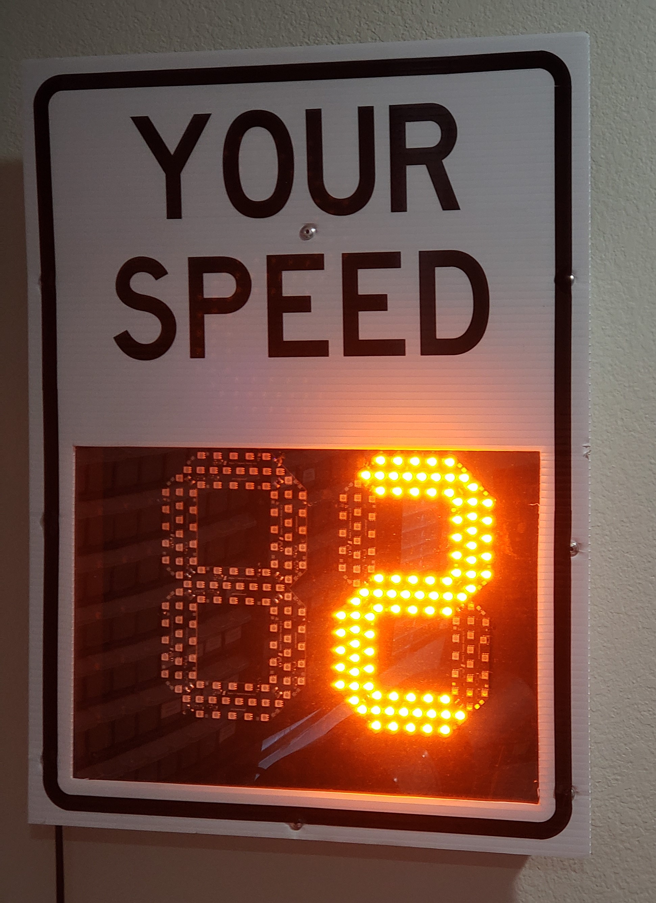

# radar-speed-sign
How much zoom is too much zoom?

This is a DIY radar speed sign based on an HB100 doppler radar sensor and a cheap microcontroller (originally an Arduino Nano, now a Pi Pico). The detection range with the stock HB100 antenna is too short for reading speeds of cars, but works well for pedestrians at close range!

This repository includes firmware for both the original project, which used Arduino (C++), and the updated kit version of the project, which runs MicroPython on a Pi Pico. PCB design and fabrication files are also included. Have fun!

[Project Writeup](https://johnmcnelly.com/arduino-radar-speed-sign/)

[Electronics Kit Store Link](https://pantsforbirds.com/product/radar-speed-sign/)